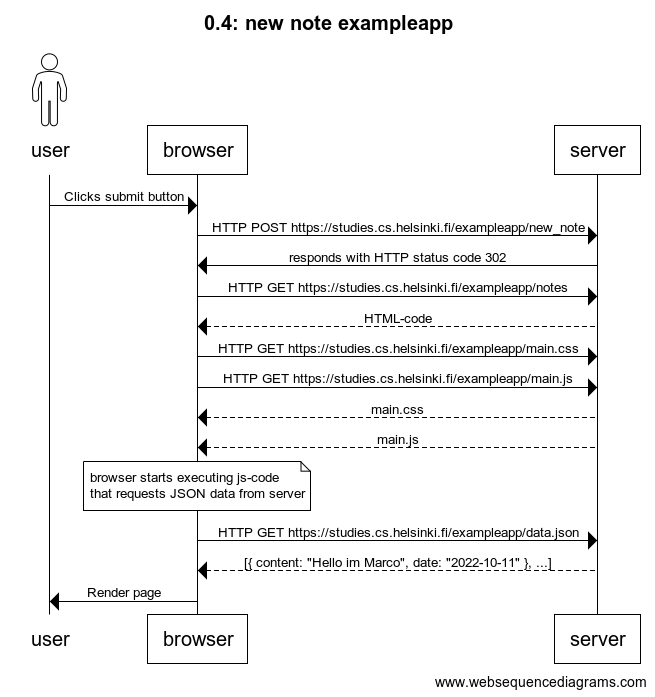
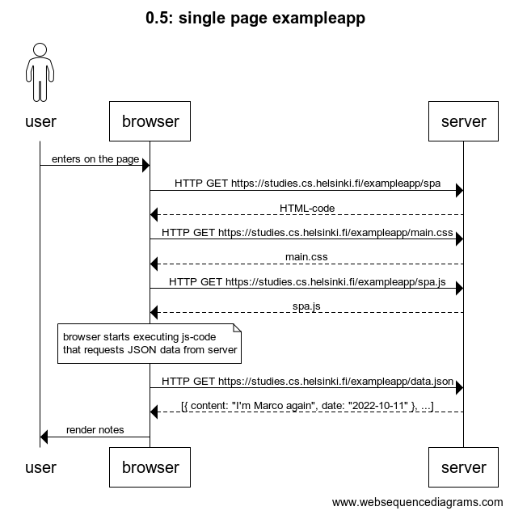
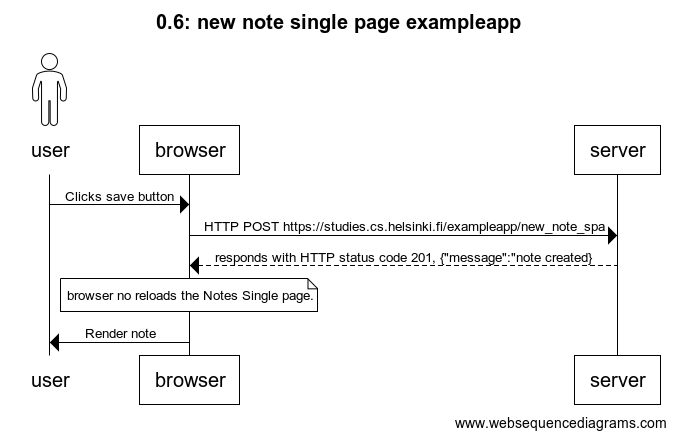

# [Fundamentos de las aplicaciones web](https://fullstackopen.com/es/part0/fundamentos_de_las_aplicaciones_web)

## 0.4: nueva nota

Crear un diagrama que describa la situación en la que el usuario crea una nueva nota en la página https://studies.cs.helsinki.fi/exampleapp/notes escribiendo algo en el campo de texto y haciendo clic en el botón submit.

### Solución



```
title 0.4: new note exampleapp
actor user
user->browser: Clicks submit button

browser->server: HTTP POST https://studies.cs.helsinki.fi/exampleapp/new_note

server->browser: responds with HTTP status code 302

browser->server: HTTP GET https://studies.cs.helsinki.fi/exampleapp/notes
server-->browser: HTML-code
browser->server: HTTP GET https://studies.cs.helsinki.fi/exampleapp/main.css
browser->server: HTTP GET https://studies.cs.helsinki.fi/exampleapp/main.js
server-->browser: main.css
server-->browser: main.js

note over browser:
browser starts executing js-code
that requests JSON data from server
end note

browser->server: HTTP GET https://studies.cs.helsinki.fi/fullstack-exampleapp.herokuapp.com/data.json
server-->browser: [{ content: "Hello im Marco", date: "2022-10-11" }, ...]

browser->user: Render page
```

## 0.5: Aplicación de una sola página

Cree un diagrama que describa la situación en la que el usuario accede a la versión de aplicación de una sola página de la aplicación de notas en https://studies.cs.helsinki.fi/exampleapp/spa.

### Solución



```
title 0.5: single page exampleapp

actor user
user->browser: enters on the page
browser->server: HTTP GET https://studies.cs.helsinki.fi/exampleapp/spa
server-->browser: HTML-code 
browser->server: HTTP GET https://studies.cs.helsinki.fi/exampleapp/main.css
server-->browser: main.css
browser->server: HTTP GET https://studies.cs.helsinki.fi/exampleapp/spa.js
server-->browser: spa.js

note over browser:
browser starts executing js-code
that requests JSON data from server
end note

browser->server: HTTP GET https://studies.cs.helsinki.fi/exampleapp/data.json
server-->browser: [{ content: "I'm Marco again", date: "2022-10-11" }, ...]

browser->user: render notes
```

## 0.6: Nueva nota en aplicación de una sola página

Cree un diagrama que represente la situación en la que el usuario crea una nueva nota utilizando la versión de una sola página de la aplicación.

### Solución



```
title 0.6: new note single page exampleapp
actor user
user->browser: Clicks save button

browser->server: HTTP POST https://studies.cs.helsinki.fi/exampleapp/new_note_spa
server-->browser: responds with HTTP status code 201, {"message":"note created}
note over browser:
browser no reloads the Notes Single page.
end note
browser->user: Render note
```